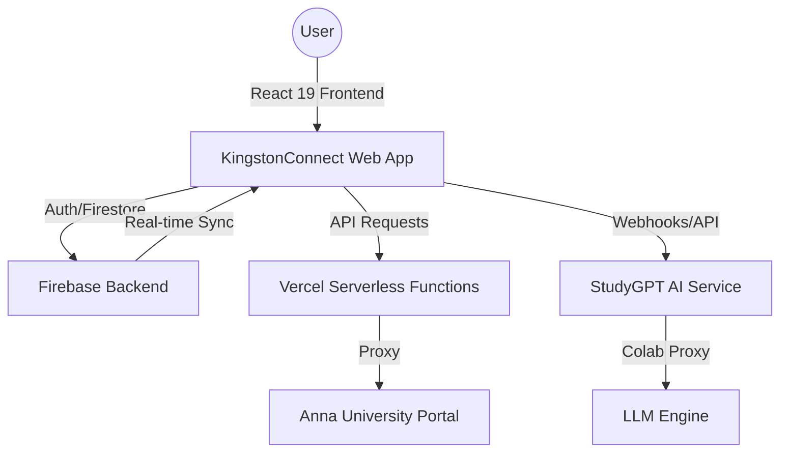

# <a name="header"></a>KingstonConnect

<div align="center">
  
  <h3>Seamless College Management for Kingston Engineering College</h3>
  <p>Empowering students and faculty with real-time academic insights, AI-driven study support, and collaborative tools.</p>

  [](https://github.com/vincenzo-afk/KingstonConnect)
  [](https://react.dev/)
  [](https://vitejs.dev/)
  [](https://firebase.google.com/)
  [](https://tailwindcss.com/)
  [](LICENSE)

  [**Live Demo**](https://kingston-connect-5113.web.app) • [**Report Bug**](https://github.com/vincenzo-afk/KingstonConnect/issues) • [**Request Feature**](https://github.com/vincenzo-afk/KingstonConnect/issues)
</div>

---

## <a name="toc"></a>Table of Contents
- [About the Project](#about-the-project)
- [Key Features](#key-features)
- [Architecture](#architecture)
- [Tech Stack](#tech-stack)
- [Getting Started](#getting-started)
- [Usage](#usage)
- [Project Structure](#project-structure)
- [Features & Roadmap](#features-roadmap)
- [Testing](#testing)
- [Deployment](#deployment)
- [Contributing](#contributing)
- [Security](#security)
- [License](#license)
- [Acknowledgments](#acknowledgments)

---

## <a name="about-the-project"></a>About the Project

**KingstonConnect** is a comprehensive college management web platform specifically designed for **Kingston Engineering College (KEC)**. It serves as a unified hub for students, teachers, HODs, and principals, facilitating seamless communication, academic tracking, and administrative efficiency.

The platform addresses the complexities of modern engineering education by integrating real-time data from the **Anna University (CoE) Portal**, providing personalized AI-driven study assistance, and offering robust tools for attendance, assignments, and collaboration.

---

## <a name="key-features"></a>Key Features

- 🎓 **AU Portal Integration**: Real-time fetching of exam results, internal marks, and CGPA directly from Anna University.
- 🤖 **StudyGPT**: An advanced, student-aware AI assistant that leverages your academic data to provide personalized support.
- 💬 **Real-time Chat**: Instant messaging and collaboration threads for students and staff powered by Firestore.
- 📅 **Academic Management**: Interactive timetables, attendance tracking with predictors, and centralized assignment submission.
- 📝 **Notes Repository**: A shared space for uploading, organizing, and accessing study materials.
- 📢 **Instant Notifications**: Stay updated with college announcements and upcoming events via the integrated calendar.
- 🌓 **Modern UI/UX**: Fully responsive design with native Dark and Light mode support using Tailwind CSS 4.

---

## <a name="architecture"></a>Architecture

KingstonConnect follows a modern serverless architecture optimized for scalability and real-time performance.



---

## <a name="tech-stack"></a>Tech Stack

### Frontend
- **Framework:** React 19.2.0
- **Build Tool:** Vite 7.2.4
- **State Management:** Zustand 5.0.10
- **Routing:** React Router DOM 7.12.0
- **Data Fetching:** TanStack React Query 5.90.16
- **Styling:** Tailwind CSS 4.1.18 + Lucide React Icons

### Backend & Infrastructure
- **BaaS:** Firebase 12.7.0 (Auth, Firestore, Storage, Analytics)
- **Proxy Server:** Vercel Serverless Functions (@vercel/node 5.10.0)
- **AI Integration:** Custom Colab-hosted LLM via StudyGPT Service

### Database & Storage
- **Database:** Firestore (Real-time NoSQL)
- **File Storage:** Firebase Storage (for notes and attachments)

---

## <a name="getting-started"></a>Getting Started

### Prerequisites
- **Node.js:** v20.x or higher
- **npm:** v10.x or higher
- **Firebase Account:** A project set up on the [Firebase Console](https://console.firebase.google.com/)

### Installation

1. **Clone the repository:**
   ```bash
   git clone https://github.com/vincenzo-afk/KingstonConnect.git
   cd KingstonConnect
   ```

2. **Install dependencies:**
   ```bash
   npm install
   ```

3. **Set up environment variables:**
   Create a `.env` file in the root directory and add your Firebase and API credentials:
   ```env
   VITE_FIREBASE_API_KEY=your_api_key
   VITE_FIREBASE_AUTH_DOMAIN=your_project.firebaseapp.com
   VITE_FIREBASE_PROJECT_ID=your_project_id
   VITE_FIREBASE_STORAGE_BUCKET=your_project.appspot.com
   VITE_FIREBASE_MESSAGING_SENDER_ID=your_sender_id
   VITE_FIREBASE_APP_ID=your_app_id
   VITE_FIREBASE_MEASUREMENT_ID=your_measurement_id
   VITE_STUDYGPT_API_URL=your_colab_proxy_url
   ```

4. **Start the development server:**
   ```bash
   npm run dev
   ```

---

## <a name="usage"></a>Usage

### Student Dashboard
Students can view their attendance, upcoming assignments, and recent AU exam results. The **Attendance Predictor** helps students stay above the required percentage.

### AI Study Assistant (StudyGPT)
Interact with StudyGPT by navigating to the "StudyGPT" section. The AI is aware of your current grades and subjects:
```javascript
// Example query to StudyGPT
"How can I improve my CGPA based on my current internal marks in Data Structures?"
```

### Real-time Chat
Connect with classmates or faculty:
1. Navigate to **Chat**.
2. Select a thread or start a new one.
3. Messages sync in real-time across all devices.

---

## <a name="project-structure"></a>Project Structure

<details>
<summary>View Directory Tree</summary>

```text
KingstonConnect/
├── api/                # Vercel Serverless Functions (AU Portal Proxy)
├── public/             # Static assets
├── src/
│   ├── assets/         # Styles and images
│   ├── components/     # Reusable UI components
│   ├── hooks/          # Custom React hooks (Firestore sync, etc.)
│   ├── lib/            # Third-party library configurations (Firebase)
│   ├── pages/          # Application views/routes
│   ├── services/       # API and business logic (StudyGPT, AU Portal)
│   ├── stores/         # Zustand state management
│   ├── types/          # TypeScript interfaces
│   └── utils/          # Helper functions
├── firestore.rules     # Database security rules
├── firebase.json       # Firebase Hosting configuration
├── vercel.json         # Vercel deployment configuration
└── vite.config.ts      # Vite build configuration
```
</details>

---

## <a name="features-roadmap"></a>Features & Roadmap

- [x] **Firebase Integration**: Real-time database and secure authentication.
- [x] **AU Portal Proxy**: Seamless fetching of university data.
- [x] **StudyGPT v2**: Personalized AI academic support.
- [x] **Role-based Access**: Custom views for all user types.
- [x] **Dark/Light Mode**: Full theme support.
- [ ] **Mobile App**: Native iOS/Android versions using React Native.
- [ ] **Offline Mode**: Support for basic features without internet access.
- [ ] **Automated Grading**: AI-assisted assignment evaluation for teachers.

---

## <a name="testing"></a>Testing

Run the linting suite to ensure code quality:
```bash
npm run lint
```

Type checking:
```bash
npm run build # This runs tsc -b before building
```

---

## <a name="deployment"></a>Deployment

### Firebase Hosting
The project is configured to deploy to Firebase Hosting:
```bash
npm run build
firebase deploy --only hosting
```

### Vercel (API & Web)
Pushing to the `main` branch triggers an automatic deployment on Vercel for the web app and serverless functions.

---

## <a name="security"></a>Security

- **Authentication**: Powered by Firebase Auth with secure token handling.
- **Firestore Rules**: Granular security rules ensure users only access their own data and shared public content.
- **Environment Variables**: Sensitive API keys are never exposed in the source code.

---

## <a name="license"></a>License

Distributed under the MIT License. See `LICENSE` for more information.

---

## <a name="acknowledgments"></a>Acknowledgments

- **Kingston Engineering College** for the inspiration and user base.
- **Anna University** for providing the academic data infrastructure.
- **The React & Firebase Communities** for the robust ecosystem.

---

<div align="center">
  <a href="#header">Back to Top</a>
  <br/>
  Built with ❤️ by <b>vincenzo-afk</b>
</div>
